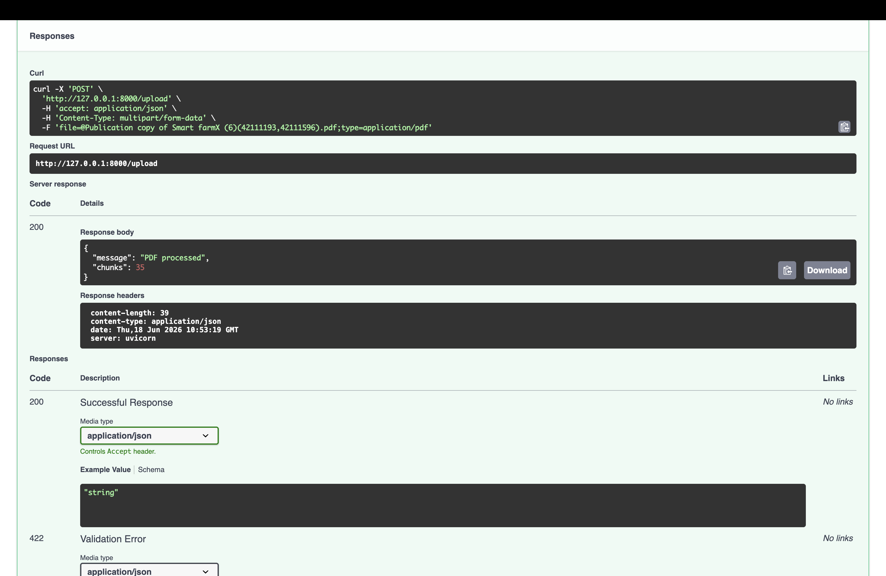
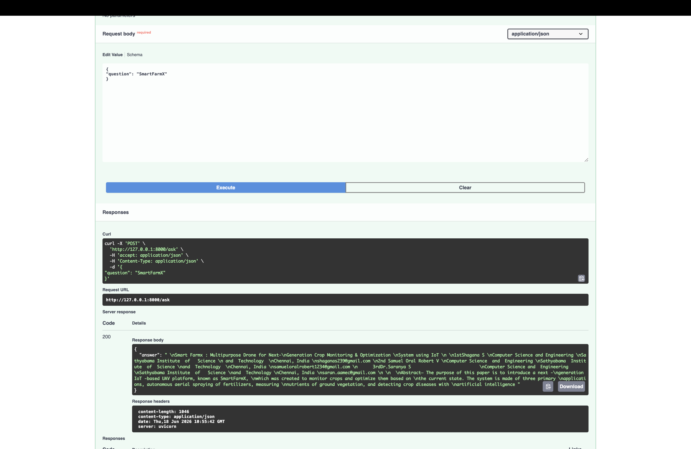
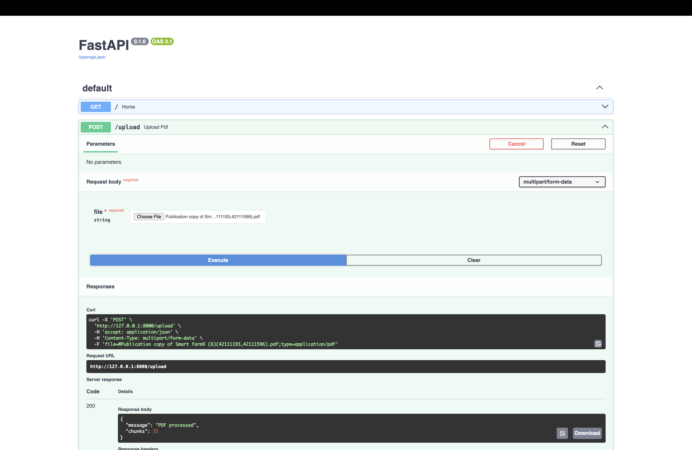

# DocuMind — AI Document Intelligence System

> RAG-based document intelligence system — upload a PDF, ask questions in natural language, get context-aware answers using semantic search and sentence embeddings.

---

## How It Works
PDF Upload -> Text Extraction -> Chunking (1000 chars)

Sentence Embeddings (all-MiniLM-L6-v2)

|

FAISS Vector Index

|

Semantic Search (top-k similarity)

|

Relevant chunk returned as answer

No keyword matching. The system finds contextually relevant passages even when the exact words don't appear in the query.

---

## Tech Stack

| Layer | Technology |
|---|---|
| API | FastAPI + Uvicorn |
| PDF Parsing | PyPDF |
| Embeddings | sentence-transformers (all-MiniLM-L6-v2) |
| Vector Search | FAISS (IndexFlatL2) |
| Language | Python 3.10+ |

---

## API Endpoints

### Upload a PDF
POST /upload

Content-Type: multipart/form-data
Returns: { "message": "PDF processed", "chunks": <int> }

### Ask a Question
POST /ask

Content-Type: application/json

{ "question": "What is the refund policy?" }
Returns: { "answer": "<most relevant passage>" }

### Health Check
GET /

Returns: { "status": "DocuMind running" }

---

## Run Locally
git clone https://github.com/leumaslarotrebor/documind

cd documind

pip install -r requirements.txt

uvicorn app.main:app --reload

Open: http://127.0.0.1:8000/docs

---

## Project Structure
documind/

├── app/

│   ├── main.py          # FastAPI app, routes, chunking logic

│   ├── pdf_utils.py     # PDF text extraction via PyPDF

│   └── vector_store.py  # FAISS index + sentence-transformer embeddings

├── requirements.txt

├── render.yaml          # Deployment config (Render)

└── README.md

---

## Deployment

Configured for Render (render.yaml included):
- Build: pip install -r requirements.txt
- Start: uvicorn app.main:app --host 0.0.0.0 --port 10000

---

## Future Improvements

- [ ] Streaming responses
- [ ] Reranking layer (cross-encoder models)
- [ ] Persistent vector DB (ChromaDB or Pinecone)
- [ ] Multi-document support with source attribution
- [ ] Simple UI dashboard

---

## Author

Samuel Oral Robert V
GitHub: https://github.com/leumaslarotrebor
Portfolio: https://leumaslarotrebor.github.io
LinkedIn: https://linkedin.com/in/samuel-oral-robert-v-4226813a4/

---

## Demo

### Upload a PDF

### Query the Document

### API Overview

